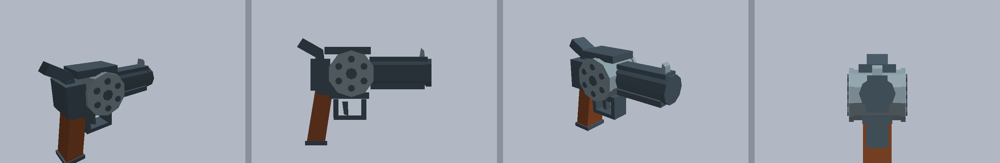

# RevolverArena

RevolverArena is a compact Roblox arena shooter built around a server-authoritative six-shot revolver. The repository uses Rojo so Luau code, the arena model, Lighting configuration, and the gameplay Tool can be reviewed and versioned in Git while Roblox Studio remains the runtime and publishing environment.



## Project status

### Working

- Lobby-to-arena entry, respawn-to-lobby flow, safe spawn selection, and spawn protection
- Server-validated firing, ammo, reload, combat roll, raycasts, hit confirmation, kills, deaths, streaks, and wanted state
- First-person camera, viewmodel animation, recoil, sway, bob, muzzle flash, tracers, and feedback effects
- Fusion-owned runtime HUD, ammo and roll status, kill feed, scoreboard, lobby prompt, transitions, and local settings
- Rojo-managed western arena, Lighting, and the `StarterPack.Revolver` Tool

### In progress

- Final revolver/viewmodel visual polish and imported-asset review
- Production audio replacement; presentation config still references built-in placeholder sounds
- Repeated Roblox Studio multiplayer testing across lobby, combat, death, and re-entry

### Planned

No progression, cosmetics, shop, persistent leaderboard, or badge roadmap is committed in this repository yet. Add planned systems here only after the team agrees on scope and ownership.

## Quick start

Install Git, Roblox Studio, and Rokit first. Then:

```powershell
git clone https://github.com/Lerdwut/REVOLVERARENA.git
cd REVOLVERARENA
rokit install
wally install
rojo plugin install
rojo build default.project.json -o REVOLVERARENA.rbxlx
rojo serve default.project.json
```

Open `REVOLVERARENA.rbxlx` in Roblox Studio, open the Rojo 7 plugin, and connect to the running server. Install the [UI Labs plugin](https://create.roblox.com/store/asset/14293316215/UI-Labs) once, then follow [SETUP.md](docs/SETUP.md), the [Fusion/UI Labs workflow](docs/ui-workflow.md), and the [architecture guide](docs/architecture.md) for runtime UI ownership and troubleshooting.

## Collaboration model

- **Gameplay / Backend Programmer:** server combat, game-state lifecycle, validation, remotes, and authoritative configuration
- **UI / UX Programmer:** HUD, menus, scoreboard, settings, transitions, and other player-facing UI
- **3D / Animation / VFX Programmer:** revolver source assets, viewmodel motion, weapon presentation, VFX, and audio presentation

Ownership identifies the default editor and reviewer, not an exclusive permission boundary. Shared contracts require coordination; see [ownership.md](docs/ownership.md).

## Repository map

```text
assets/revolver/                         Blender, FBX, glTF, manifest, and QA renders
docs/                                    Setup, architecture, workflow, ownership, and Studio guides
src/ReplicatedStorage/Config/            Authoritative and presentation configuration
src/ReplicatedStorage/Shared/            Cross-boundary constants and game-state helpers
src/ReplicatedStorage/UI/                Pure Fusion components, theme tokens, and UI Labs stories
src/ServerScriptService/Combat/          Server weapon, reload, and hit validation
src/ServerScriptService/Game/            Arena lifecycle and game-mode state
src/StarterPlayer/StarterPlayerScripts/  Client controllers, shared helpers, Fusion UI root/modules, and viewmodel
src/starterpack/Revolver.rbxmx           Rojo-managed gameplay Tool
src/workspace/Arena.model.json           Rojo-managed arena, lobby, and spawn markers
tools/                                   Asset-generation utilities
Packages/                                 Generated Wally shared dependencies (ignored)
DevPackages/                              Generated Wally development dependencies (ignored)
default.project.json                     Rojo DataModel mapping
rokit.toml                               Preferred tool manifest; pins Rojo 7.7.0
wally.toml                               Wally dependency manifest
wally.lock                               Locked Wally dependency versions
```

## Team guides

- [Setup](docs/SETUP.md)
- [Architecture](docs/architecture.md)
- [Git and GitHub workflow](docs/workflow.md)
- [Fusion/UI Labs workflow](docs/ui-workflow.md)
- [Ownership boundaries](docs/ownership.md)
- [Roblox Studio and asset workflow](docs/ROBLOX_STUDIO.md)
- [Contributing](docs/CONTRIBUTING.md)
- [Revolver import notes](assets/revolver/IMPORT.md)

## Links

- [GitHub repository](https://github.com/Lerdwut/REVOLVERARENA)
- [Rojo 7 documentation](https://rojo.space/docs/v7/)
- [Rokit](https://github.com/rojo-rbx/rokit)

No gameplay video is tracked in the repository. Revolver QA images are available under `assets/revolver/`.
